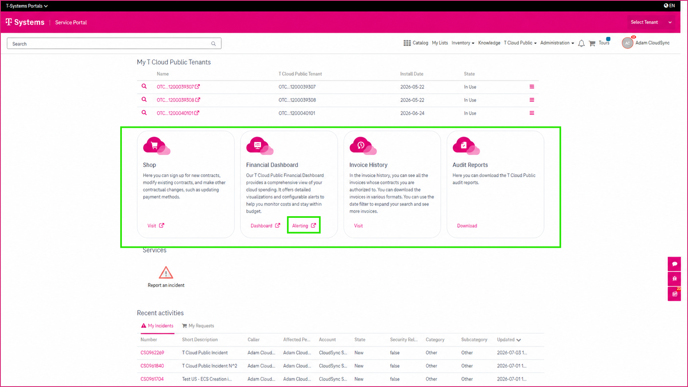

1 Accessing Integrated Applications with Single Sign-On
=======================================================

The CSM Portal provides **Single Sign-On (SSO)** access to several integrated applications, allowing you to open supported services directly from the portal without signing in again. If you have the required user roles, the integrated applications are available in the **T Cloud Public** section on the **CSM Portal home page**. The applications displayed depend on your assigned permissions.

----------------------
Available Applications
----------------------

Depending on your permissions, the following integrated applications may be available:

* **eShop**
* **Financial Dashboard**
* **Alerting Service**
* **Invoice History**
* **Audit Reports**

---------------------------------
Opening an Integrated Application
---------------------------------

To open an application:

1. Sign in to the CSM Portal.
2. Navigate to the landing page.
3. Select the application you want to open.
4. The application opens automatically using your existing CSM Portal session.

No additional sign-in is required.

------------------
Access Permissions
------------------

Access to integrated applications is controlled through your assigned user permissions. If an application is not displayed or you cannot access it, verify that you have the appropriate permissions. If necessary, contact your organization's administrator or your support team for assistance.
