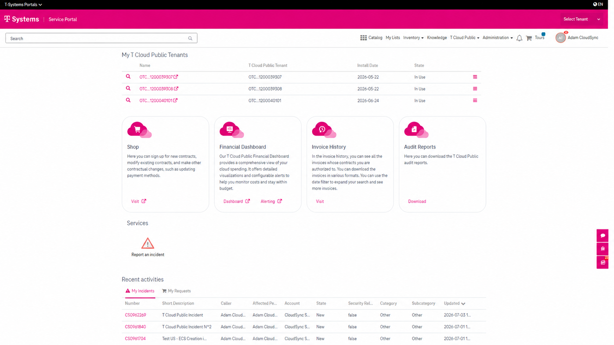

T Cloud Public in the CSM Portal
=================================

Overview
--------

The CSM Portal provides a range of features to help you manage your T Cloud Public services throughout
their lifecycle.

If you have the required user roles, the **T Cloud Public** section is available directly from the **CSM Portal home page**. After signing in, the widgets and functions available to you are displayed automatically based on your assigned permissions.

If you cannot see the **T Cloud Public** section, you may not have the required permissions. In this case, please contact your administrator.

This article provides an overview of the T Cloud Public features available in the CSM Portal. For step-by-step instructions on each feature, refer to the related Knowledge Base articles.

What can you do?
----------------

The CSM Portal supports the following T Cloud Public activities:

* **Manage your T Cloud Public tenants**
  View your assigned tenants, access the T Cloud Public Console, review tenant information, report incidents, and request tenant renames.

* **Report and track incidents**
  Create support incidents, monitor their status, communicate with the support team, and manage your cases from a central location.

* **Manage users and permissions**
  Use the Role Shop to manage users and non-contractual group memberships, helping ensure users have access to the portal features and services they require.

* **Access integrated applications**
  Launch supported applications, such as the eShop, Financial Dashboard, Alerting Service, Invoice History, and Audit Reports, using Single Sign-On.

* **View invoices and request audit reports**
  Access invoices for your assigned contracts and request audit reports directly from the CSM Portal.

* **Work with multiple tenants**
  Use the Tenant Picker to quickly switch between tenants when working in tenant-specific areas of the portal.

Related Articles
----------------

For detailed information about each feature, see:

.. toctree::
   :maxdepth: 1

   accessing-applications-with-ssoc
   managing-tenants
   reporting-managing-incidents
   working-with-inventory
   renaming-tenant
   viewing-downloading-invoices
   requesting-audit-reports
   using-tenant-picker
   managing-users-role-shop
   user-roles-permissions
