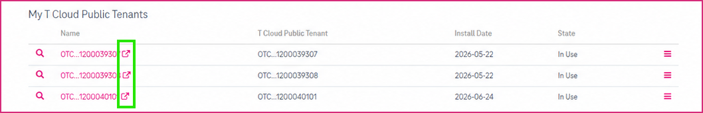
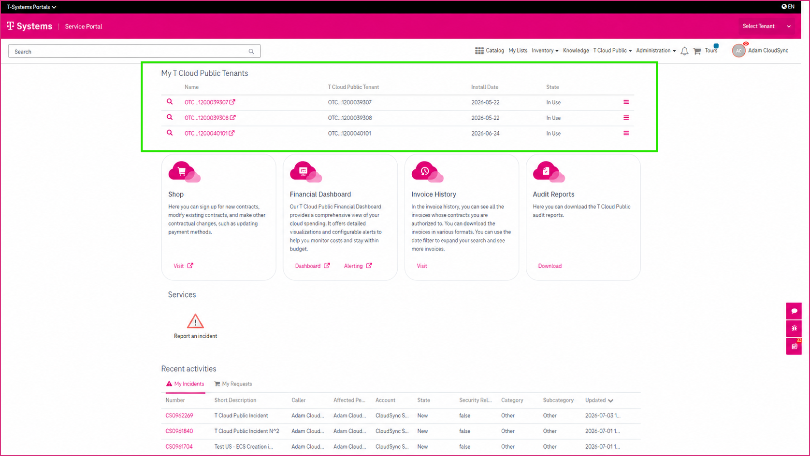
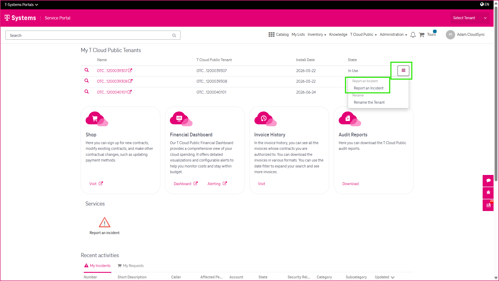
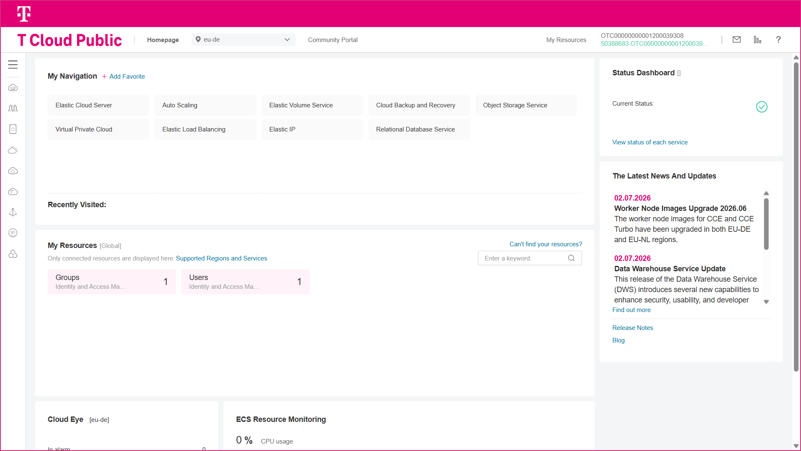
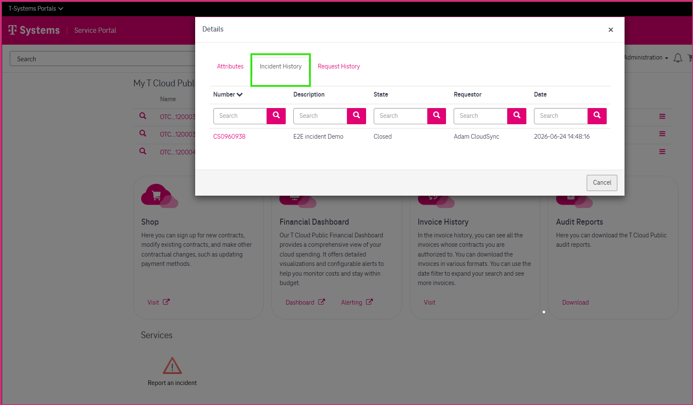
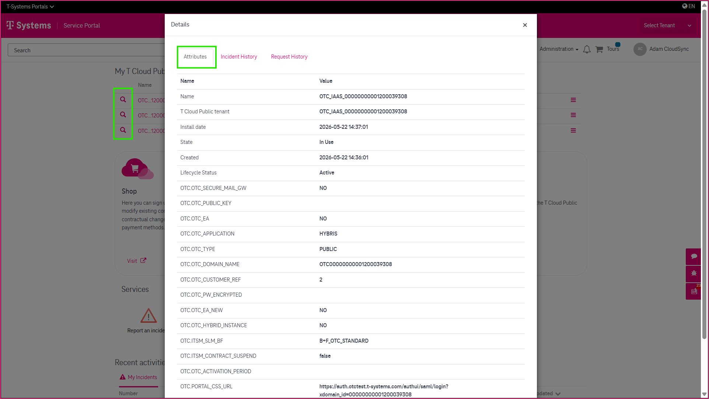

2 Managing Your T Cloud Public Tenants
======================================

The **My T Cloud Public Tenant** widget provides a central place to view and manage the T Cloud Public tenants assigned to your organization. From this widget, you can access tenant-specific information, launch the **T Cloud Public Console**, report incidents, review incident history, and request a tenant rename.

---------------------------------------------
Accessing the My T Cloud Public Tenant Widget
---------------------------------------------

If you have the required user roles, the **My T Cloud Public Tenant** widget is available in the **T Cloud Public** section on the **CSM Portal home page**. The widget displays all T Cloud Public tenants assigned to your organization.

-----------------
Available Actions
-----------------

For each tenant, you can perform the following actions.

~~~~~~~~~~~~~~~~~~~~~~~~~~~~~~~
Open the T Cloud Public Console
~~~~~~~~~~~~~~~~~~~~~~~~~~~~~~~

Click the Open Details icon (↗) next to a tenant to launch the **T Cloud Public Console** directly from the CSM Portal using Single Sign-On.

~~~~~~~~~~~~~~~~~~~~~~~
View Tenant Information
~~~~~~~~~~~~~~~~~~~~~~~

Click on the magnifying icon to see all attributes of your tenant.

.. image:: _static/images/managing-tenants_6_1.png
   :alt: Screenshot of the tenant attributes view

~~~~~~~~~~~~~~~~~~~~~~~
Review Incident History
~~~~~~~~~~~~~~~~~~~~~~~

View incidents that have previously been reported for the selected tenant.

~~~~~~~~~~~~~~~~~~
Report an Incident
~~~~~~~~~~~~~~~~~~

Create a new support incident for the selected tenant. When you create an incident from the **My T Cloud Public Tenant** widget, the tenant is automatically associated with the incident, reducing manual input. For more information, see **Reporting and Managing Incidents**.

~~~~~~~~~~~~~~~
Rename a Tenant
~~~~~~~~~~~~~~~

Submit a request to assign a more meaningful name to a tenant. For detailed instructions, see **Renaming a T Cloud Public Tenant**.

