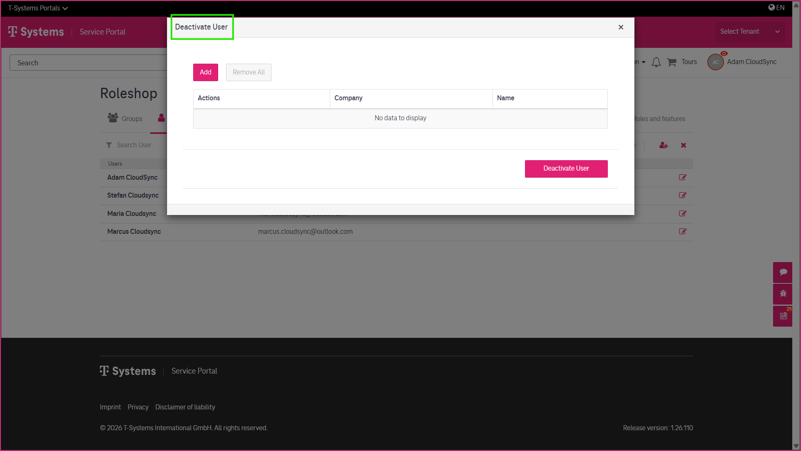
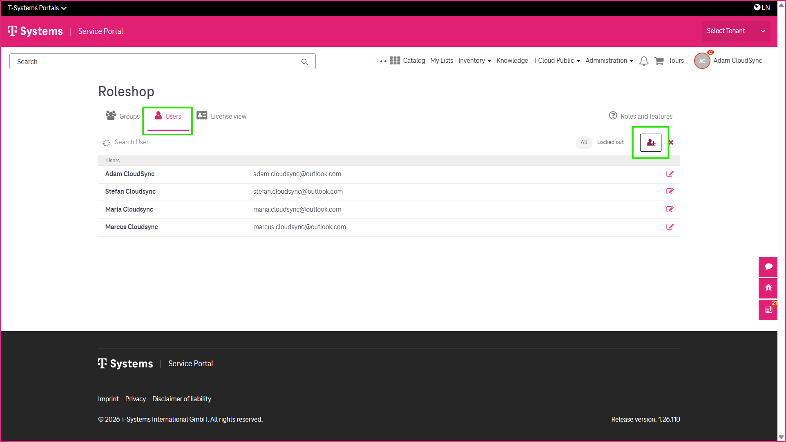
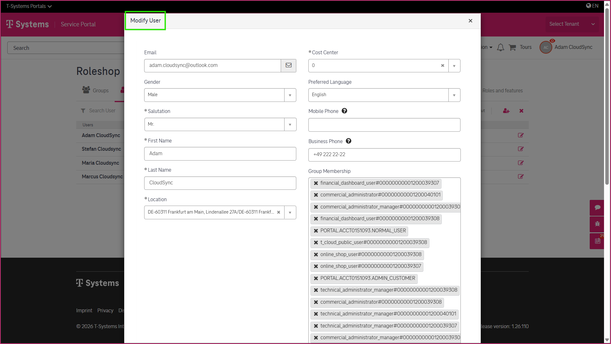
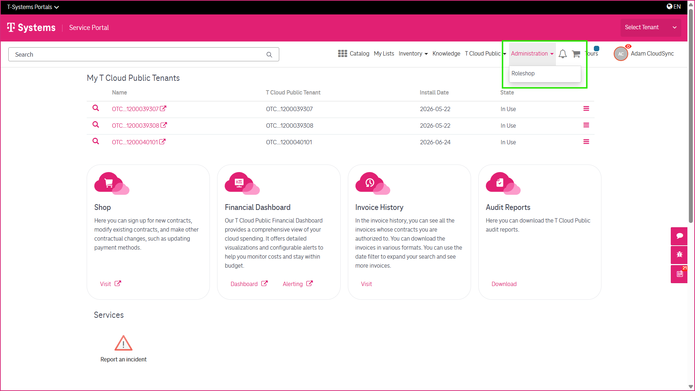

9 Managing Users with the Role Shop
===================================

The **Role Shop** enables customer administrators to manage users and non-contractual group memberships for their T Cloud Public services. From the Role Shop, you can create users, update user information, deactivate users, and manage access to portal features and services.

-----------------------
Accessing the Role Shop
-----------------------

If you have the required user roles, you can access the Role Shop from the T Cloud Public section in the CSM Portal.

If your organization manages multiple T Cloud Public tenants, use the **Tenant Picker** to select the tenant you want to administer before making any changes.

--------------
Managing Users
--------------

The Role Shop allows you to perform the following user administration tasks:

* Create new users
* Update user information
* Deactivate users
* Manage non-contractual group memberships

Changes made through the Role Shop determine which portal features and services users can access.

-------------------------------
Simplifying User Administration
-------------------------------

To simplify user administration, the Role Shop provides **manager groups**. Instead of assigning users to multiple individual permission groups, you can assign them to a single manager group. This automatically grants all associated permissions. Removing a user from the manager group also removes those associated permissions.

-----------------------
Processing Your Changes
-----------------------

Each administrative change submitted through the Role Shop automatically creates a service request. Once the request has been processed, the requested changes are applied throughout the CSM Portal.

.. image:: _static/images/managing-users-role-shop_31_1.png
   :alt: Screenshot showing service request confirmation

