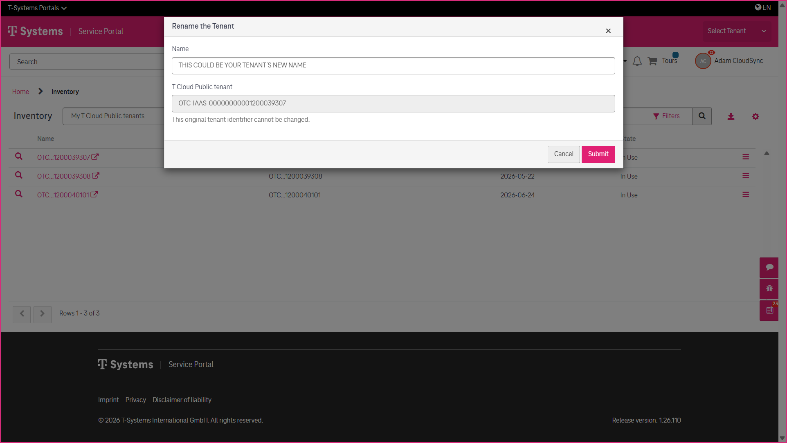
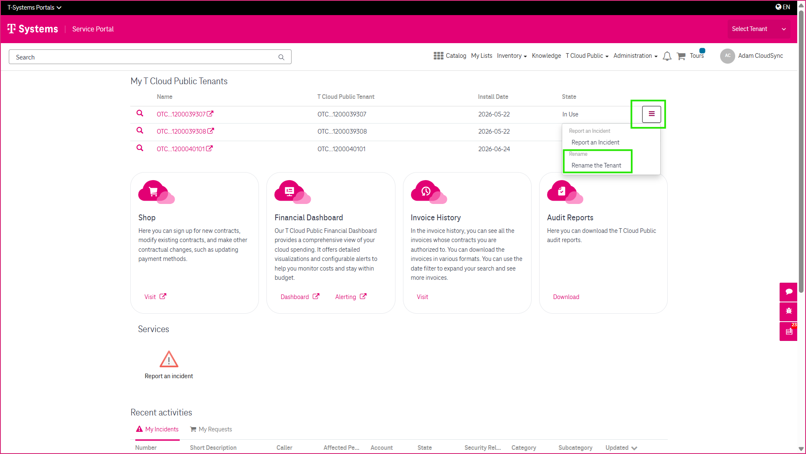
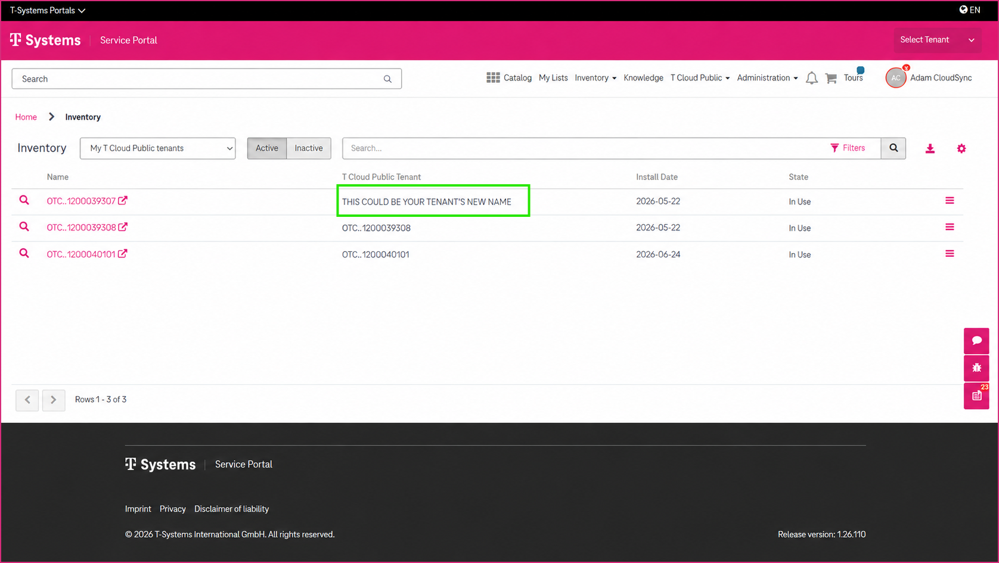

5 Renaming a T Cloud Public Tenant
==================================

The **Rename Tenant** function allows you to assign a more meaningful name to a T Cloud Public tenant. The new name helps you identify your tenants more easily throughout the CSM Portal.

----------------
Before You Begin
----------------

Please note that the **Rename Tenant** function is available only for T Cloud Public tenants assigned to your organization.

-----------------
Renaming a Tenant
-----------------

To rename a tenant:

1. Locate the tenant you want to rename in the **My T Cloud Public Tenant** widget.
2. Click the **hamburger menu** (☰) next to the tenant.
3. Select **Rename Tenant**.
4. Enter the new tenant name.
5. Submit the request.

A service request is created automatically.

----------------------------
After Submitting the Request
----------------------------

Once the tenant has been successfully renamed, the service request is closed automatically.

