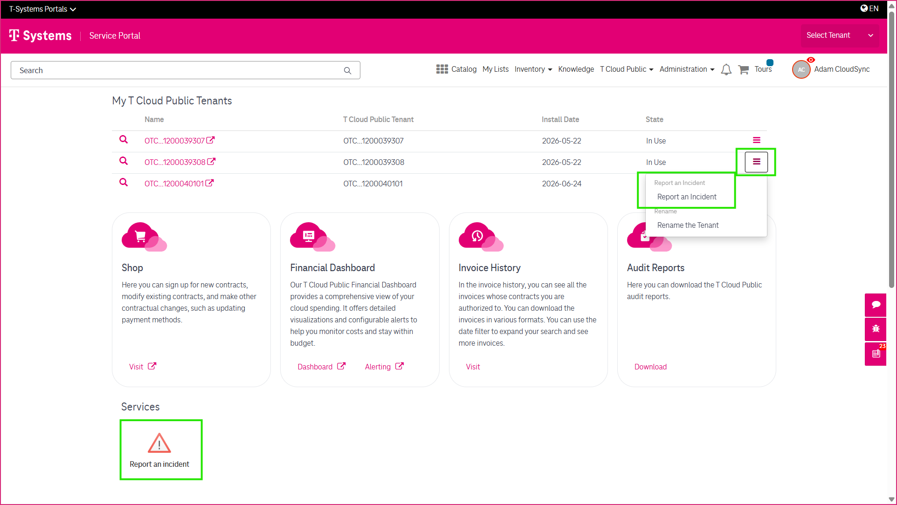
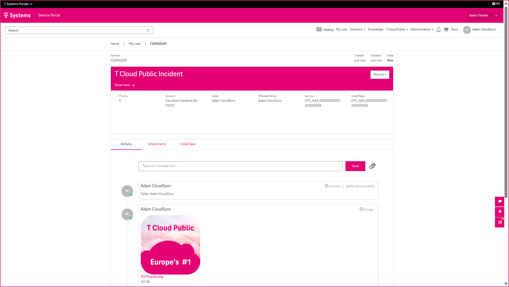
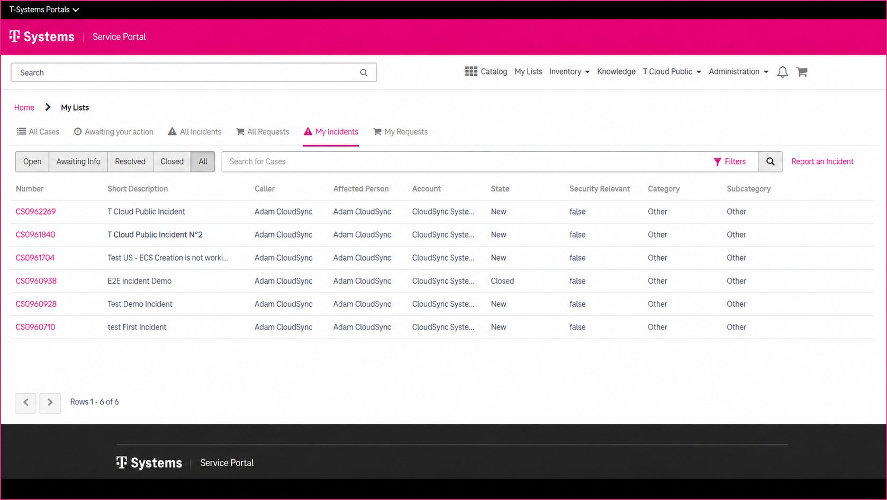

3 Reporting and Managing Incidents
==================================

If you experience an issue with your **T Cloud Public** environment, you can report it directly through the CSM Portal. The portal provides a guided incident reporting process and allows you to track the progress of your incidents throughout their lifecycle.

----------------
Before You Begin
----------------

Before reporting an incident, gather as much relevant information as possible. This helps the support team investigate and resolve your issue more efficiently.

Useful information includes:

* A clear description of the issue
* Steps to reproduce the problem
* Error messages
* Screenshots
* Log files or other supporting documents

--------------------
Creating an Incident
--------------------

You can create a support incident in two ways:

* From the **Report an Incident** catalog item on the **CSM Portal home page**
* From the **My T Cloud Public Tenant** widget

~~~~~~~~~~~~~~~~~~~~~~~~~~~~~~~~~~~~~~~
Creating an Incident from the Home Page
~~~~~~~~~~~~~~~~~~~~~~~~~~~~~~~~~~~~~~~

1. Open the **CSM Portal**.
2. Select **Report an Incident**.
3. Complete the required information.
4. Attach supporting files if required.
5. Submit the incident.

~~~~~~~~~~~~~~~~~~~~~~~~~~~~~~~~~~~~~~~~~~~~~~~~~~~~~~~~~~~~~
Creating an Incident from the My T Cloud Public Tenant Widget
~~~~~~~~~~~~~~~~~~~~~~~~~~~~~~~~~~~~~~~~~~~~~~~~~~~~~~~~~~~~~

You can also create an incident directly from a specific tenant.

1. Open the **My T Cloud Public Tenant** widget.
2. Open the tenant menu.
3. Select **Report an Incident**.
4. Complete the incident form.
5. Submit the incident.

When you create an incident from the tenant widget, the selected tenant is automatically associated with the incident, reducing manual input.

----------------------------
Completing the Incident Form
----------------------------

Provide the required information, including:

* Incident description
* Business impact

You can also attach supporting documents such as:

* Screenshots
* Log files
* Other relevant files

----------------------------
After Submitting an Incident
----------------------------

After you submit the form, a support case is created automatically.

The **Case Details** page allows you to:

* Monitor the current status
* Review all case information
* Follow updates in the activity stream
* View and download attachments

-----------------------
Managing Your Incidents
-----------------------

All incidents and service requests are available under **My Lists**.

From there, you can:

* Search for specific cases
* Filter by status or priority
* Switch between incidents, requests, or all cases
* Customize the displayed columns
* Export case information in **PDF**, **Excel**, or **CSV** format

