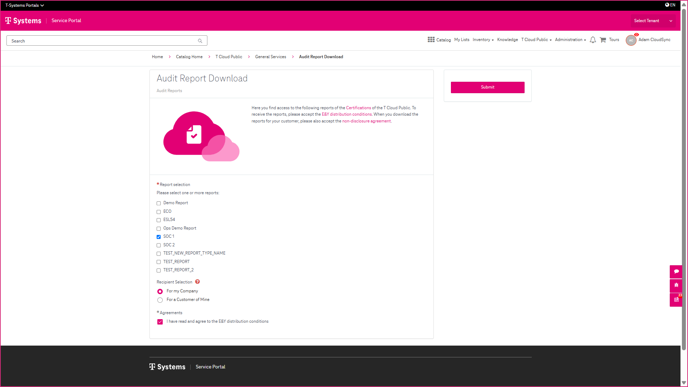
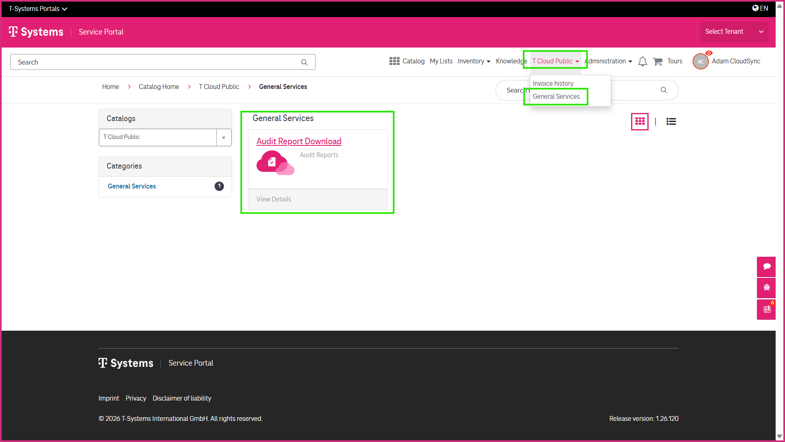
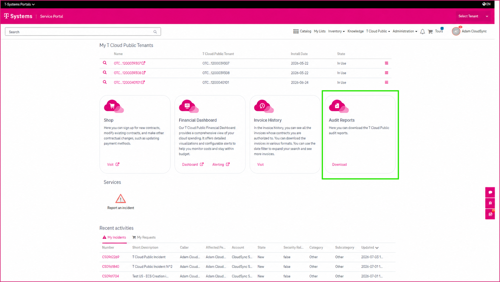
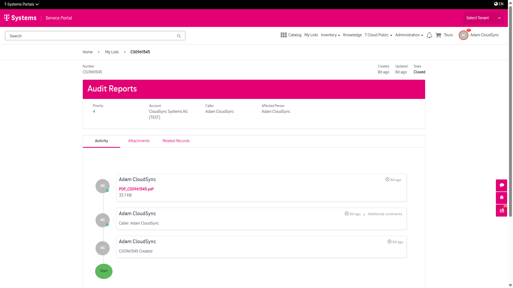
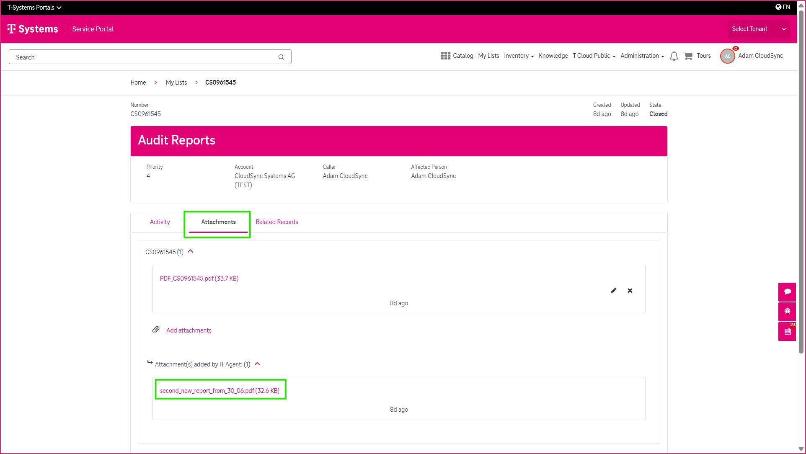

7 Requesting Audit Reports
==========================

The **Audit Reports** feature allows you to request and download audit reports for your **T Cloud Public** services directly from the CSM Portal. Each report request automatically creates a service request, allowing you to track its progress until the report is available.

-----------------------
Accessing Audit Reports
-----------------------

If you have the required user roles, you can access **Audit Reports** from:

* the **T Cloud Public** section on the portal home page, or
* the **T Cloud Public** menu in the portal header. Select **Audit Report Download** from the **General Services** catalog.

--------------------------
Requesting an Audit Report
--------------------------

To request an audit report:

* Locate **Audit Reports**.
* Click **Download** on the homepage or select the **Audit Report Download** catalog item to open the request form.
* Select the required **Report Type**.
* Complete the required information.
* Submit the request.

A service request is created automatically.

---------------------------
Downloading an Audit Report
---------------------------

Once the request has been processed, the audit report is attached to the associated service request. To download the report:

* Open the service request.
* Download the report from the **Attachments** section.

