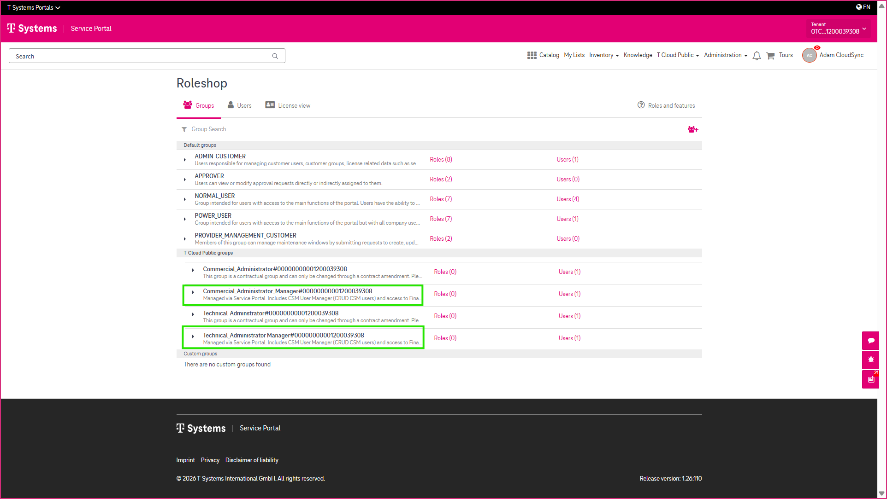
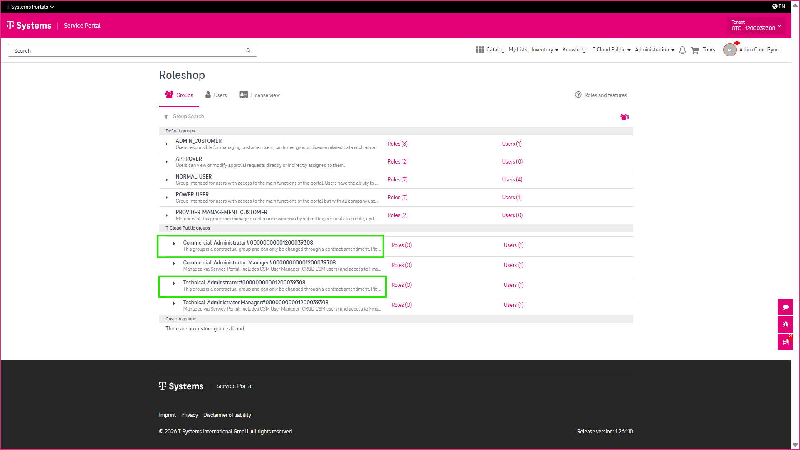
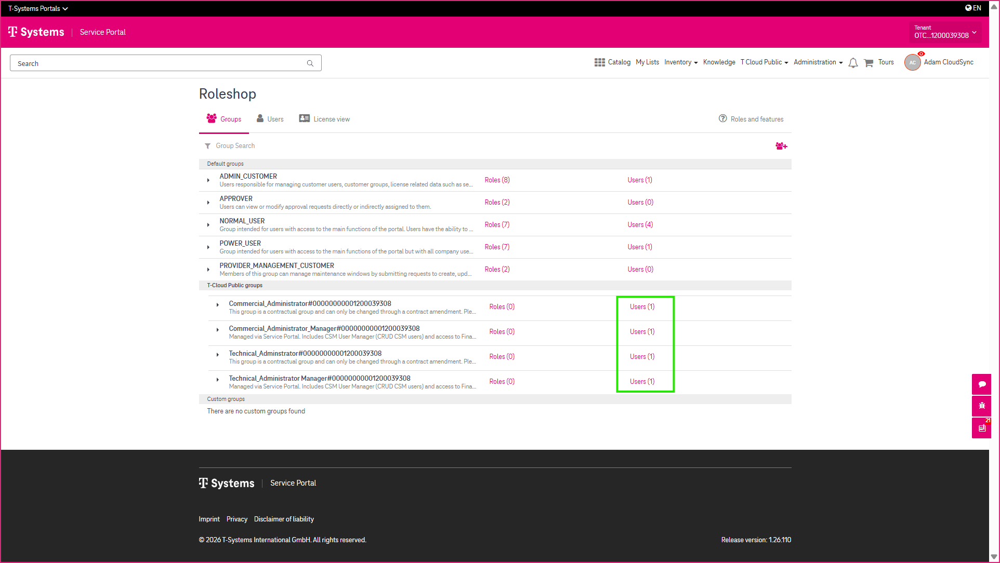
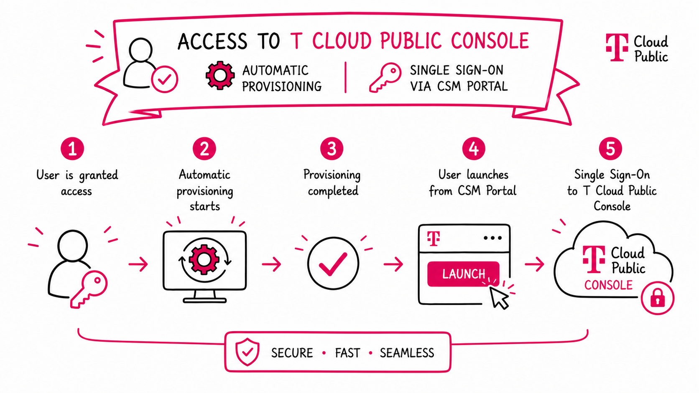

10 T Cloud Public User Roles and Permissions
============================================

The CSM Portal uses predefined user roles to ensure that users have access to the features and services required for their responsibilities. User roles are implemented through **group memberships**, which determine the functions available to each user.

-----------------
Contractual Roles
-----------------

The following roles are contractual roles:

* **Commercial Administrator**
* **Technical Administrator**

These roles are assigned as part of your T Cloud Public service and cannot be managed through the Role Shop. If changes to these roles are required, contact your support team or update the group directly in the **eShop**.

--------------
Manager Groups
--------------

To simplify user administration, the Role Shop provides **manager groups**. Rather than assigning users to multiple individual permission groups, you can assign them to a single manager group. The user automatically receives all permissions associated with that manager group. Likewise, removing a user from the manager group automatically removes those permissions.

Commercial Administrator Manager
--------------------------------

The **Commercial Administrator Manager** group acts as a container for several business-related permission groups. By assigning a user to this manager group, the user automatically receives access to the associated portal features, including:

* Audit Reports
* Invoice History
* Financial Dashboard
* eShop

**Technical Administrator Manager**
-----------------------------------

The **Technical Administrator Manager** group acts as a container for technical permission groups. It includes, for example, the **T Cloud Public User** group, which grants access to the **T Cloud Public Console**.

-------------------------------------
Managing Individual Permission Groups
-------------------------------------

In addition to using manager groups, you can also manage membership of individual permission groups by selecting **Users** in the Role Shop. This allows you to grant or remove specific permissions independently of the manager groups.

----------------------
Automatic Provisioning
----------------------

When a user is granted access to the **T Cloud Public Console**, the required provisioning is performed automatically. Once provisioning has been completed, the user can launch the **T Cloud Public Console** directly from the CSM Portal using **Single Sign-On (SSO)**.

