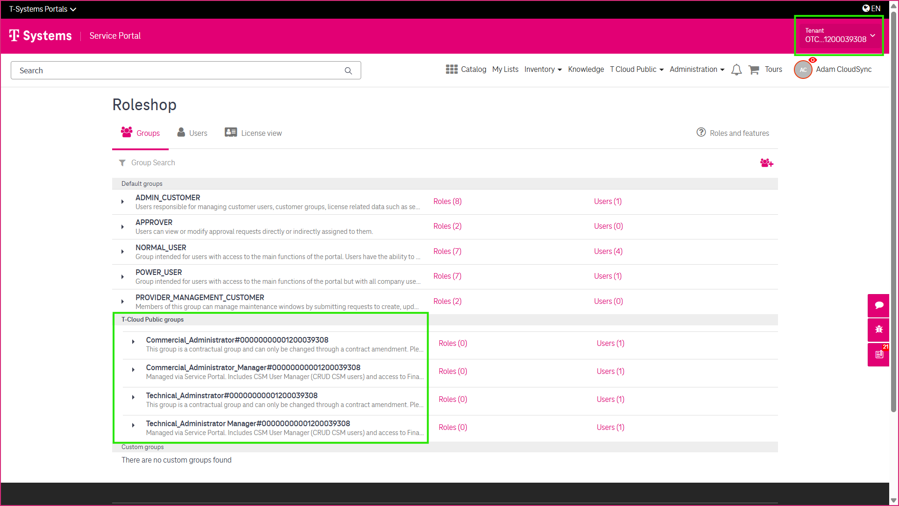
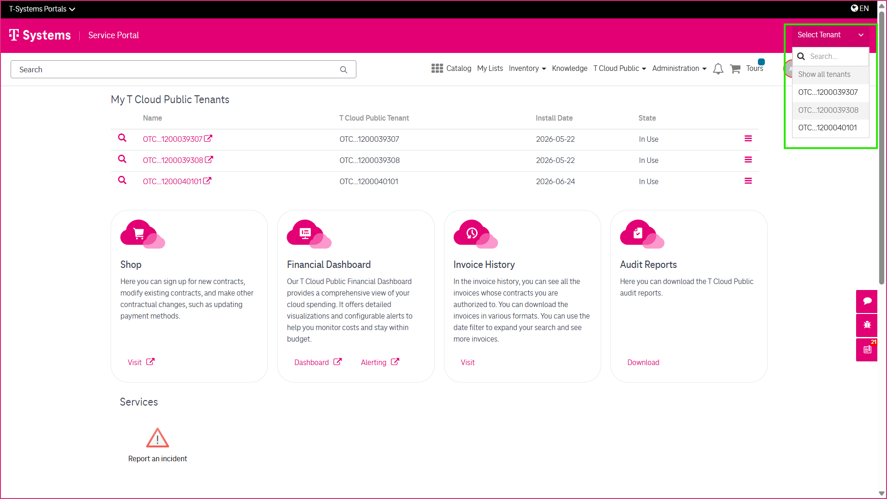

8 Using the Tenant Picker
=========================

The **Tenant Picker** helps you quickly switch between your T Cloud Public tenants when working in the CSM Portal. It is particularly useful if your organization manages multiple tenants.

---------------------------
Accessing the Tenant Picker
---------------------------

If you have the required user roles, the Tenant Picker is available in the upper-right corner of the CSM Portal.

------------------
Selecting a Tenant
------------------

To select a tenant:

1. Click the Tenant Picker.
2. Search for or select the required tenant.
3. Click the tenant name.

The selected tenant is applied immediately.

---------------------------
How the Tenant Picker Works
---------------------------

Selecting a tenant does **not** change the information displayed on the CSM Portal home page. However, in tenant-specific areas such as the Role Shop, only the groups associated with the selected tenant are displayed. This helps you manage users and permissions more efficiently when working with multiple T Cloud Public tenants.

