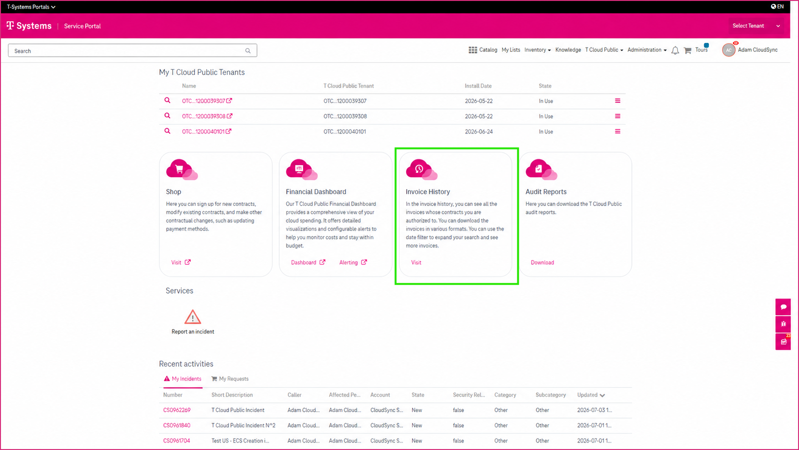
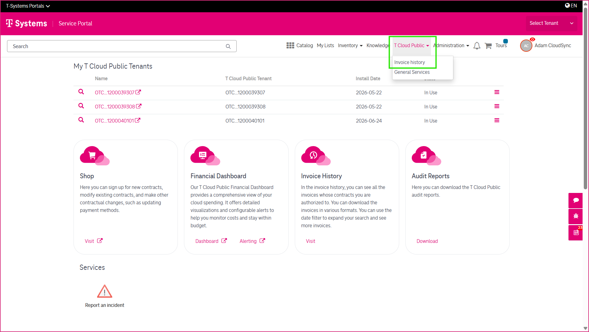
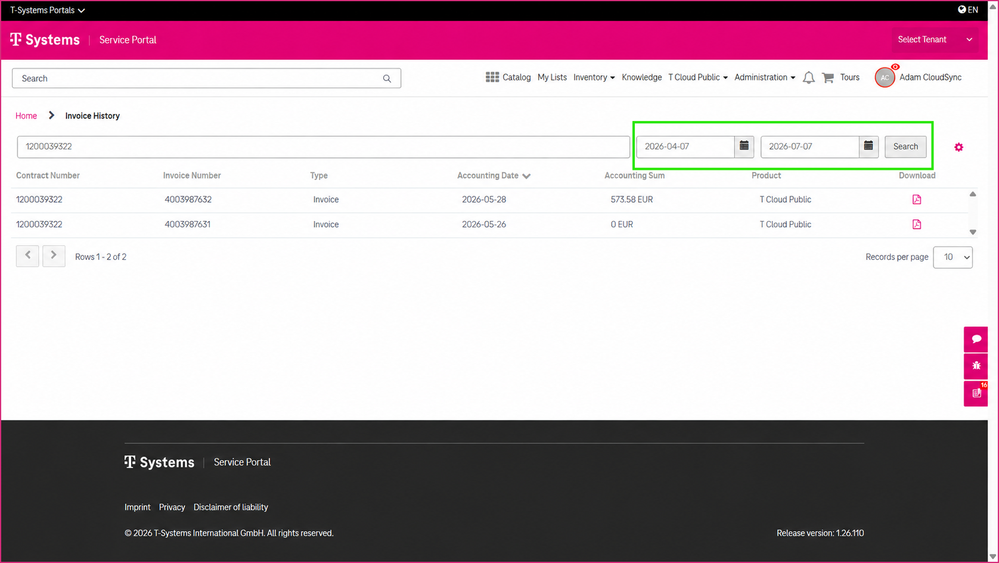
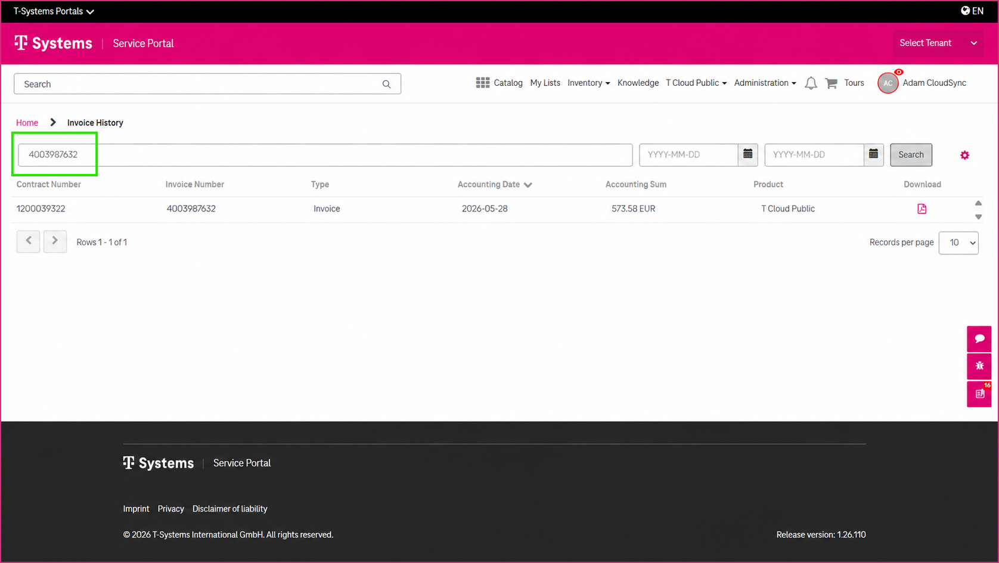
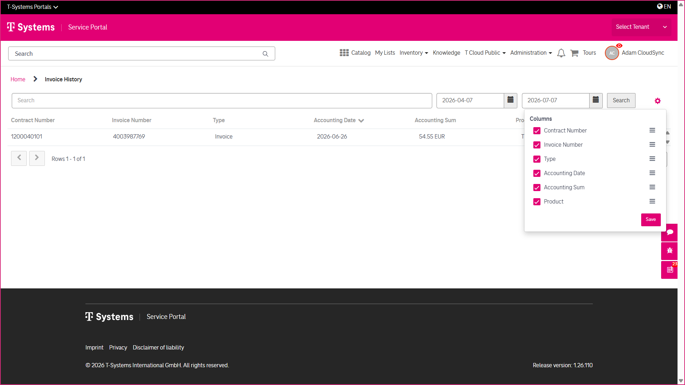
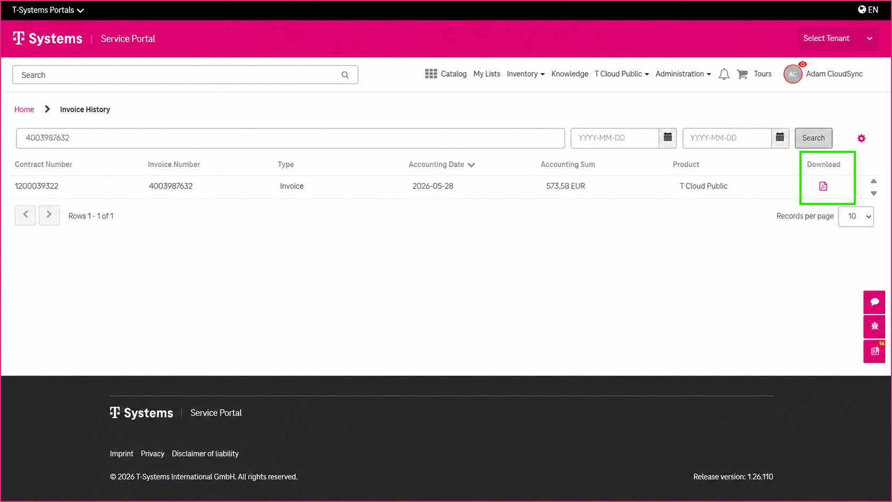

6 Viewing and Downloading Invoices
==================================

The **Invoice History** feature allows you to view and download invoices for your **T Cloud Public** services directly from the CSM Portal. Depending on your assigned user roles, you can access invoices for your assigned contracts.

-------------------------
Accessing Invoice History
-------------------------

If you have the required user roles, you can access **Invoice History** from:

* the **T Cloud Public** section on the **CSM Portal home page**,
* or the **T Cloud Public** menu in the portal header.

------------------
Finding an Invoice
------------------

To locate a specific invoice, you can:

* Select the required invoice date range.
* Search by **Contract Number** or **Invoice Number**.
* Customize the displayed columns to show the information most relevant to you.

----------------------
Downloading an Invoice
----------------------

To download an invoice:

* Locate the required invoice.
* Click the **Download** icon.
* The invoice opens as a PDF document.
* Save the PDF to your device if required.

