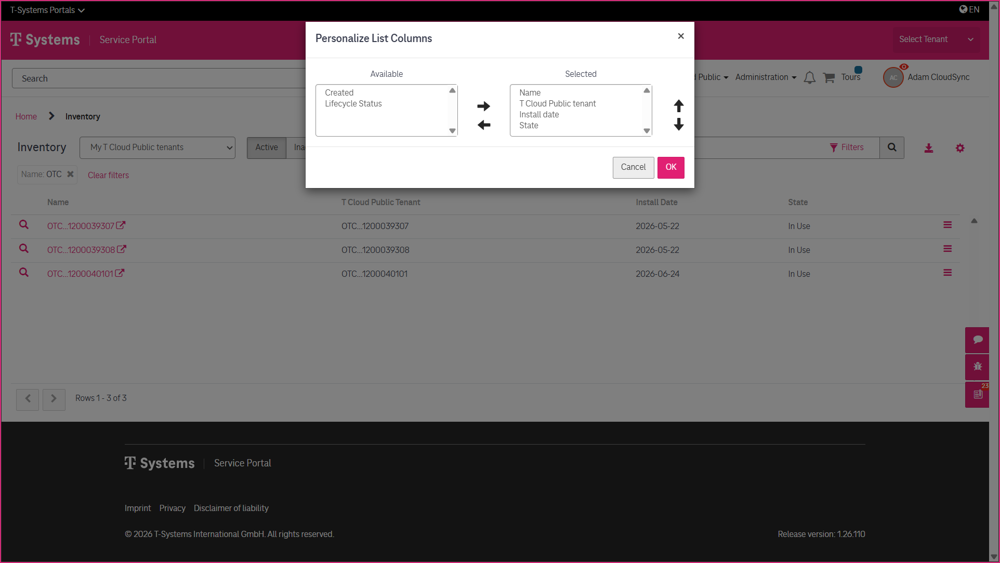
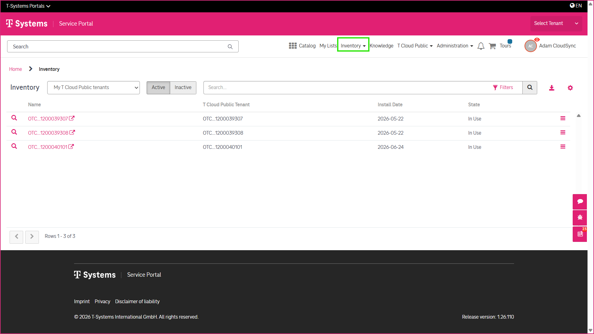
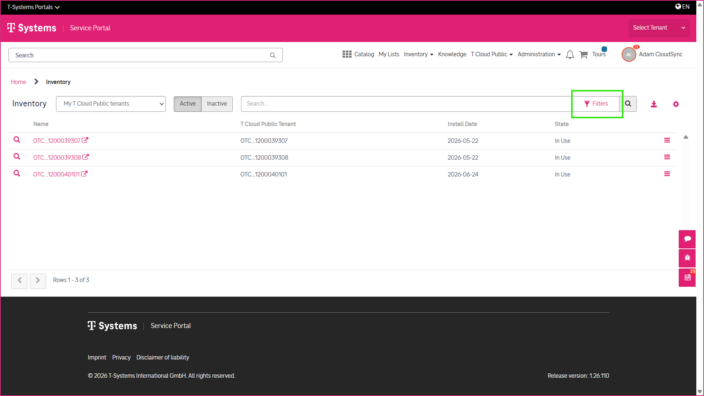
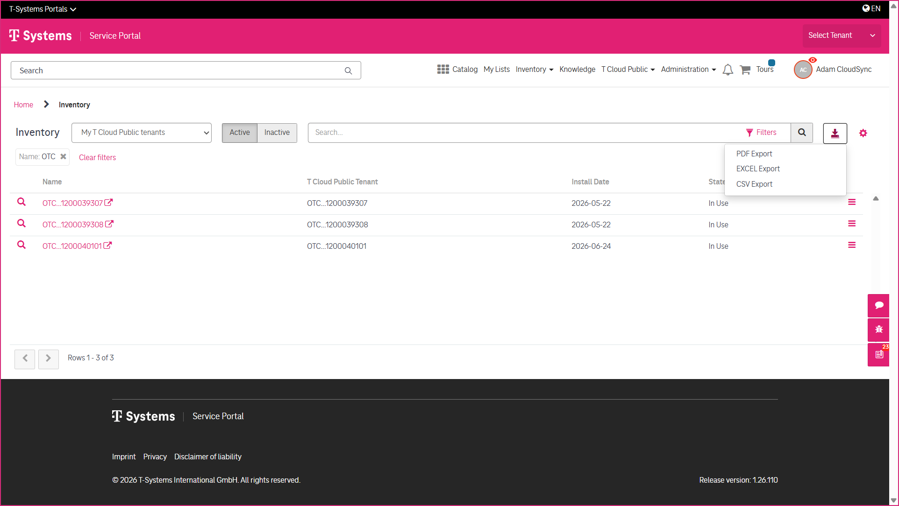
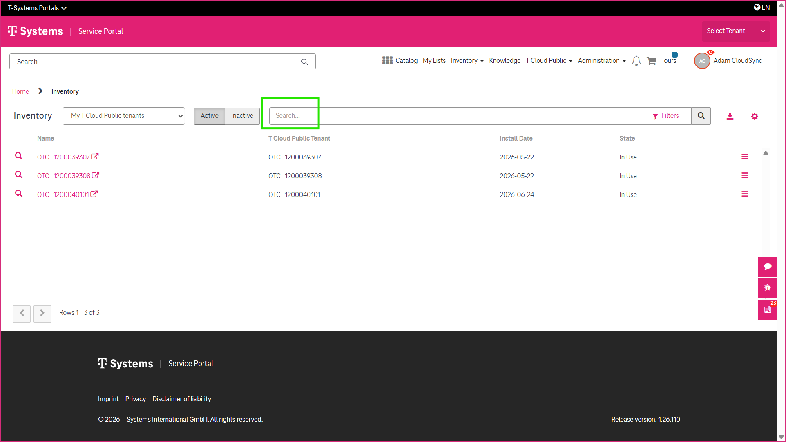
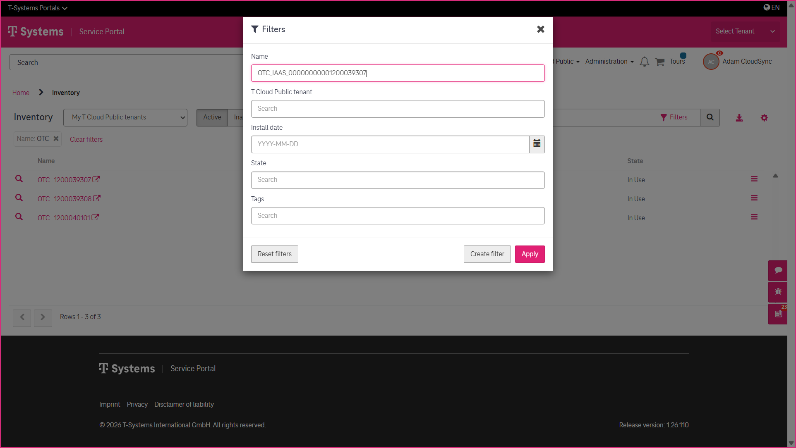

4 Working with the Inventory
============================

The **Inventory** provides a central view of your **T Cloud Public** assets, making it easy to locate and review the information you need. It offers several tools to help you search, filter, customize, and export the displayed information.

-----------------------
Accessing the Inventory
-----------------------

If you have the required user roles, you can access the **Inventory** from the **portal** header.

-----------------------
Searching the Inventory
-----------------------

Use the **Search** field to quickly locate specific inventory items.

---------------------
Filtering the Results
---------------------

Use the available filters to narrow the displayed results and focus on the information relevant to your task.

--------------------
Customizing the View
--------------------

You can customize the displayed columns to display only the information relevant to your work.

------------------------
Exporting Inventory Data
------------------------

The displayed inventory information can be exported in the available file formats for further processing or documentation.

